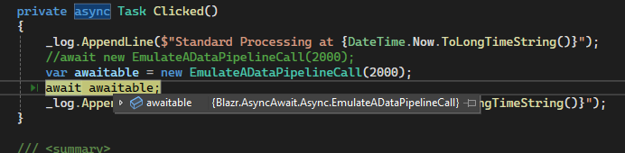

# Awaitable

Throughout these discussions I use the term *Threading Context* to describe the environment DotNetCore builds on the operating system threading infrastructure.  This is either the `Synchronisation Context` or the `Threadpool`.  These provide functionality based on the context:

1. Management of `System.Threading.Timers` to call callbacks when timers expire.
2. Management of `Awaiters` which we'll cover here.

Blazor adds extra functionality to manage posting  Renderer activity, such as servicing the Render queue and UI generated events.

The core functionality of async behaviour is the implementation of `GetAwaiter`.  Any object implementing a `GetAwaiter` which returns an object that implements the *IsCompleted/OnCompleted/GetResult* pattern can be awaited by the threading context. 

The pattern is:

```csharp
public struct MyAwaiter : INotifyCompletion
{
    public bool IsCompleted;
    public void OnCompleted(Action continuation);
    // Returns what you need
    public void GetResult();
}
```

`Task` implements these three methods and a `GetAwaiter` that returns itself.

When an object yields the threading context calls `GetAwaiter` to get an object that has: 

1. A way to detect when the awaitable is complete.
2. A context to execute the continuation.
3. A return result on completion.

We'll look at how this works in practice in the *Async/Await* section.

A Demo Awaiter

Let's explore the concept with an hyperthetical implementation.

> This is a demo to show how an awaiter works, not an implementation blueprint.  It's a pointless abstraction of `Task.Delay`.

First our object.  It's implemented as a `struct`.  `INotifyCompletion` is required by the awaiter.  We'll implement it shortly.

```csharp
public struct EmulateADbCall : INotifyCompletion
{
    public EmulateADbCall(int millisecs) {}
}
```

First the timer functionality.  It uses the threading timer. 

```csharp
public struct EmulateADbCall : INotifyCompletion
{
    private int _millisecs = 10;
    private Timer? _timer = null;
    private volatile bool _complete;

    public EmulateADbCall(int millisecs)
    {
        _millisecs = millisecs;

        if (millisecs < 0)
            throw new ArgumentOutOfRangeException(nameof(millisecs));

        _timer = new Timer(this.Complete, null, _millisecs, -1);
    }

    private void Complete(object? statusInfo)
    {
        _complete = true;
        // dispose and release the timer for GC.
        _timer?.Dispose();
        _timer = null;
    }
}
```

Now the Awaitable functionality.

`IsCompleted` maps to the internal _complete;

```csharp
    public bool IsCompleted => _complete;
```
We need to implement the completion monitor.  `SpinWait` provides a simple managed loop with yielding.  I've used this for simplicity, not efficiency.  Read the [ SpinWait MS Documents article](https://learn.microsoft.com/en-us/dotnet/standard/threading/spinwait) for more details on the subject. 

```csharp
    public void GetResult()
    {
        if (!_complete)
        {
            var wait = new SpinWait();
            while (!_complete)
                wait.SpinOnce();
        }
        return;
    }
```
`OnCompleted` is called once `GetResult` completes. 

```csharp
    public void OnCompleted(Action continuation)
    {
        if (_complete)
        {
            continuation();
            return;
        }

        var capturedContext = SynchronizationContext.Current;

        if (capturedContext != null)
            capturedContext.Post(_ => continuation(), null);
        else
            continuation();
    }
```

Finally we need to implement `GetAwaiter`.  We return `this`: `EmulateADbCall` implements the neceesary functionality.

```csharp
    public EmulateADbCall GetAwaiter()
    {
        return this;
    }
```

`Clicked` now looks like this:

```csharp
private async Task Clicked()
{
    _log.AppendLine($"Standard Processing at {DateTime.Now.ToLongTimeString()}");
    //await new EmulateADataPipelineCall(2000);
    var awaitable = new EmulateADataPipelineCall(2000);
    await awaitable;
    _log.AppendLine($"Completed Processing at {DateTime.Now.ToLongTimeString()}");
}
```

You can now see in the screenshot there's no `Task` involved, we are awaiting the instance of `EmulateADataPipelineCall` directly.

 

## Some Key Takeaways

1. Anything can be awaited.  It just needs to provide a `GetWaiter` method that returns an object that implements the correct pattern.
2. It's the responsibility of the awaiter to implement the yielding and monitoring processes.
3. `IsCompleted` is called once at the start of the process.  It tells the caller that the awaiter process has already completed.

You will probably never need to write a custom awaiter.  I've used a contrived example as I couldn't think of a simple good example for this article. However, understanding what one is and how it works will improve your fundimental understanding of the whole *async/await* framework.